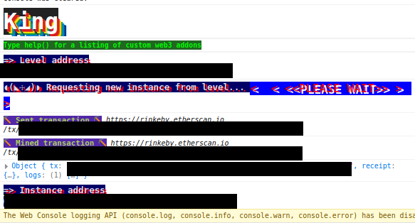

# 09: King

The Ethernaut is a Web3/Solidity based wargame inspired by overthewire.org, played in the Ethereum Virtual Machine, in which each level is based on a smart contract that needs to be "hacked".

This is a sample walkthrough for the level called "King".

## Setup

First off we need a wallet. Get the Metamask Wallet from https://metamask.io/ and choose whichever network works for you ( in my case i will be using Rinkeby's testnet).
Fund the wallet with Chainlink's faucet https://faucets.chain.link/rinkeby and then click on the button "Get new instance" to deploy the contract.

## Steps for completing the level
Click on F12 to get on Developer Tools. You will get something like this:

Go on Remix: https://remix.ethereum.org/ and make this change in King.sol. 

Copy the King.sol contract found before "submit instance" and "get new instance" buttons.

At King.sol i made this next change:
>- <value> 1. Pragma version from **0.6.0** to **0.7.6**

This level asks us to glitch the King game by finding a way to stop the proclamation of a new king. We are going to do that by sending a value higher than the actual prize ( 0.001 eth or 1e15 wei) to the receive function, where the king.transfer(msg.value) is gonna fail because our AttackTheKing contract doesnt's allow receiving eth.

At the AttackTheKing contract add the constructor:
>- <value> constructor(address payable addr) payable{
>- <value> address(addr).call{value: msg.value}("");}

It should look something like this:

Compile the King.sol contract:

 Instead of deploying King.sol we are going to interact with the already deployed contract by using instance's address showed on Developer Tools. Also, dont forget to add your wallet on Environment by selecting "Injected Provider - Metamask".

First on, check the _king, owner and prize functions:

We are going to add 0.002 eth (2e15 wei) to send, who's gonna act as the new prize and then deploy the AttackTheKing contract by initializing it with the instance's address. 

Check again the King's contract functions:

Wow, congrats!! Now you have managed to become the new King, update the prize value without receiving back any eth and complete this level.

Now finish the level by using the submit button at the bottom of the page.

Congrats! See you on to the next level.:wave: